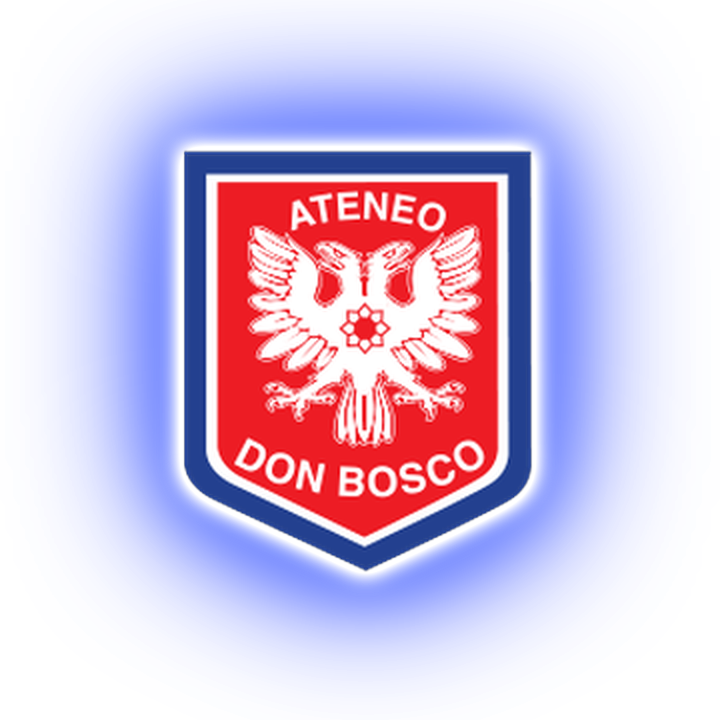
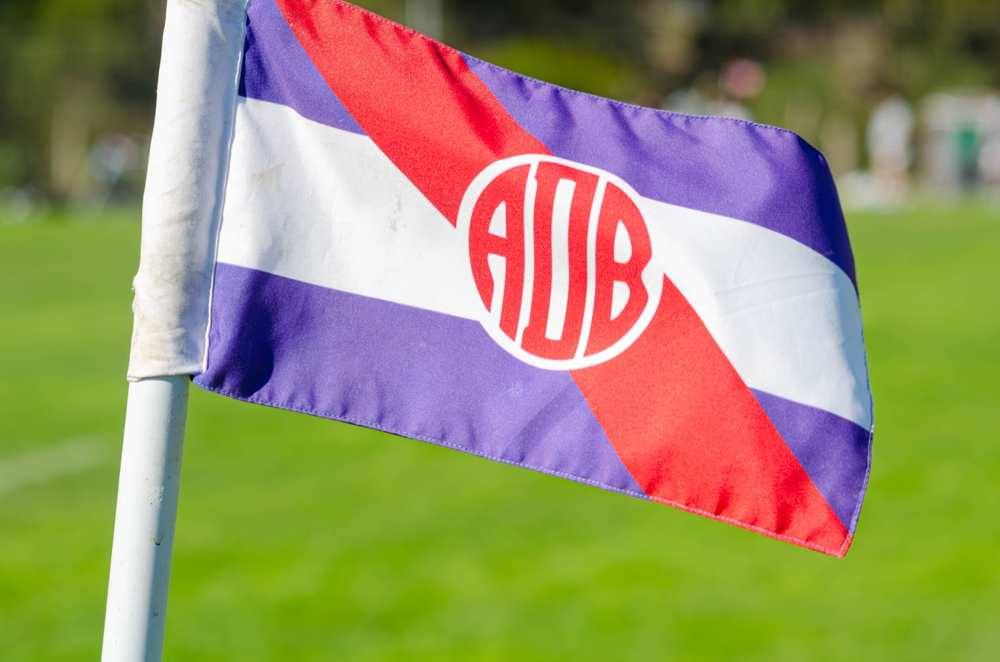
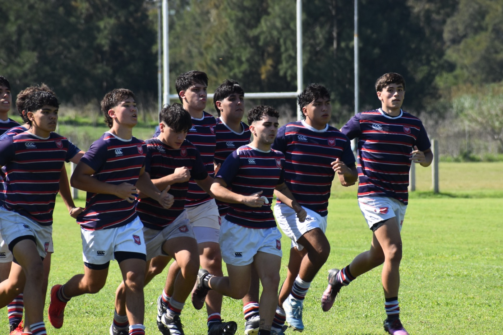
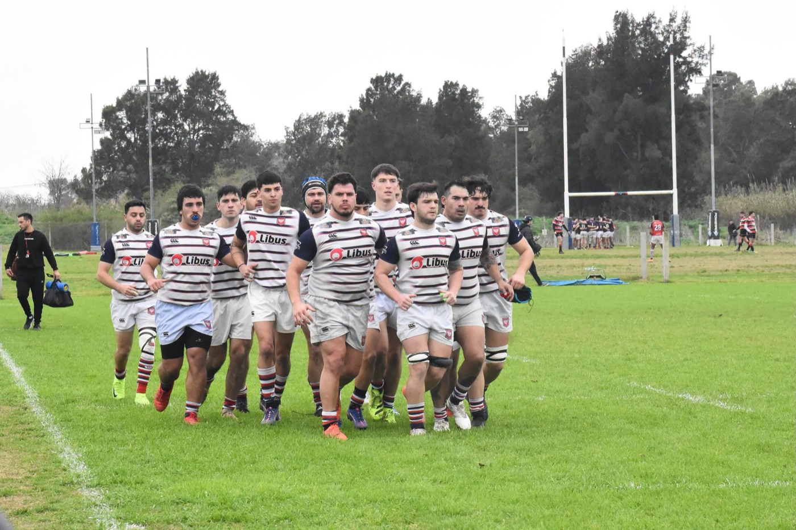
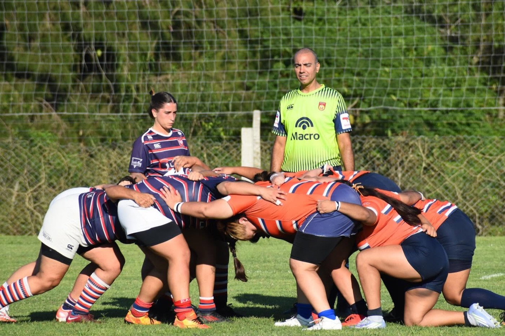
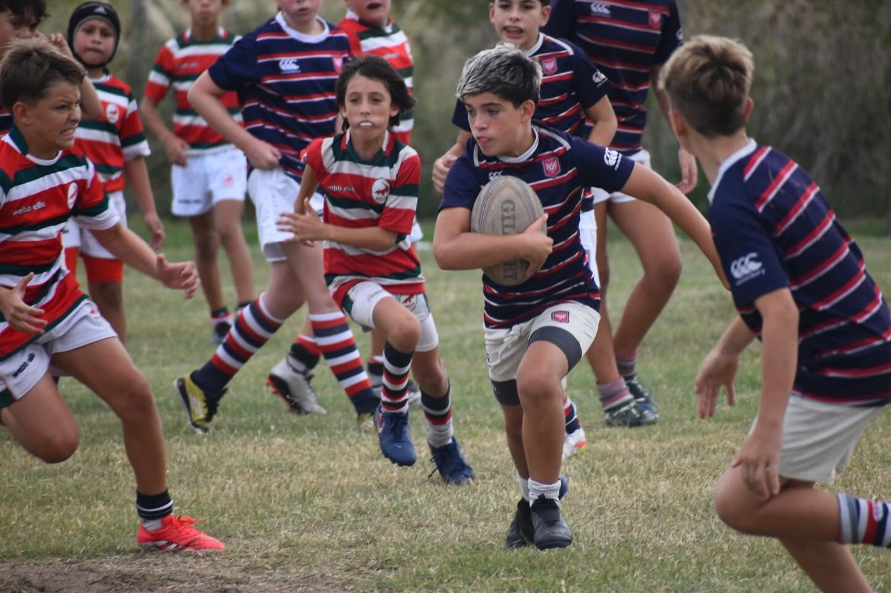
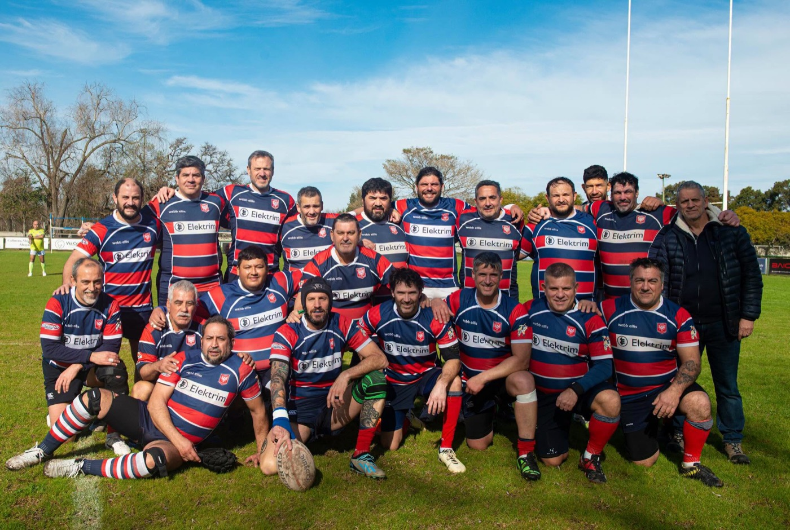
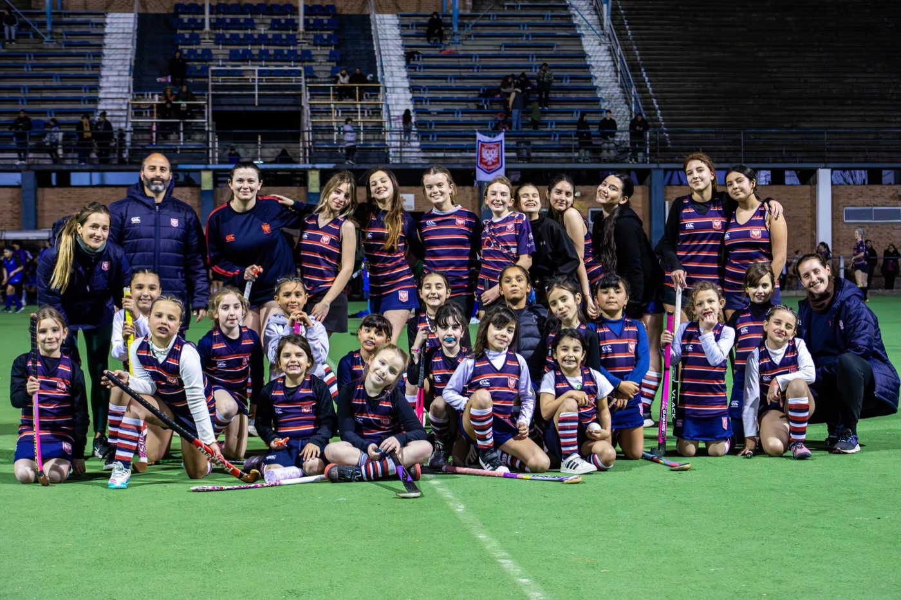

<div align="center">

# Don Bosco Rugby



### Ateneo Cultural y Deportivo Don Bosco
**Bernal · URBA Primera B**




</div>

<br>

Sitio oficial del club. Es un sitio estático en HTML, CSS y JavaScript puros: sin build, sin dependencias y sin backend. Toma los colores de los flyers del club: franjas azul, blanco y rojo en V, bloques azules y fechas en pestañas rojas inclinadas.

## Qué incluye

| | |
| --- | --- |
| **Fixture y resultados** | Primera B 2026, con escudos de los rivales. El próximo partido, la racha y las estadísticas se calculan solos. |
| **Formación XV** | Fotos y puestos de la Primera. |
| **Categorías** | Plantel superior, femenino, infantil, juvenil, Ocelotes y hockey. |
| **El club** | Historia, predio, El Ceibo, Consejo Directivo, presidentes, capitanes, Decálogo y contacto. |
| **Noticias** | Filtro por categoría y una página propia por nota. |
| **Sponsors** | Carrusel infinito justo después de la portada. |
| **Tema claro y oscuro** | Automático según el sistema. |
| **Mobile primero** | Sin scroll horizontal desde 320 px, con zonas de toque de 44 px. |

## El club

<table>
  <tr>
    <td width="33%"></td>
    <td width="33%"></td>
    <td width="33%"></td>
  </tr>
  <tr>
    <td align="center"><b>Juveniles</b></td>
    <td align="center"><b>Plantel superior</b></td>
    <td align="center"><b>Femenino</b></td>
  </tr>
  <tr>
    <td></td>
    <td></td>
    <td></td>
  </tr>
  <tr>
    <td align="center"><b>Infantiles</b></td>
    <td align="center"><b>Ocelotes</b></td>
    <td align="center"><b>Hockey</b></td>
  </tr>
</table>

## Estructura

```text
Web/
├── index.html        Contenido y secciones
├── css/styles.css    Estilos; tokens de color y tipografía en :root
├── js/app.js         Datos y comportamiento
├── noticias/         Una página HTML por nota
└── assets/
    ├── crest.png     Escudo del club
    ├── dbr/          Fotos y gráficos del club (versiones -web, livianas)
    ├── clubs/        Escudos de los rivales
    ├── players/      Fotos de la formación (p1.jpg a p15.jpg)
    ├── sponsors/     Un logo por sponsor
    ├── noticias/     Imágenes de cada nota
    └── readme/       Imágenes de este README
```

HTML, CSS y JS están separados: no van estilos ni scripts dentro del HTML.

## Cómo actualizar el contenido

Casi todo se edita en `Web/js/app.js`.

| Qué | Dónde | Formato |
| --- | --- | --- |
| Resultados y fixture | array `M` | `[fecha, "AAAA-MM-DD", rival, "L"\|"V", tantos DB, tantos rival, hora]`. Los partidos por jugar llevan `null, null` y la hora. Los tantos de Don Bosco van siempre primero. |
| Formación XV | array `XV` | `[número, nombre, apellido, puesto]`. La foto es `assets/players/p{número}.jpg`. |
| Noticias | array `N` | `c` categoría, `d` fecha ISO, `t` título, `x` resumen, `u` link. La primera nota es la destacada. Las categorías del filtro están en `CATS`. |
| Sponsors | `index.html` | Logo en `assets/sponsors/` y un `<li class="car-item">`. El JS duplica los ítems para el bucle infinito. |
| Escudos de rivales | `assets/clubs/` | `{nombre}.png` en minúsculas, sin tildes, espacios ni puntos (`cudequilmes.png`). Sin archivo se muestran las iniciales. |
| Banner de portada | `assets/dbr/bandera-web.jpg` | Si existe se muestra la foto; si no, el escudo sobre las franjas. |

Las fechas 1 a 13 del fixture son la primera ronda y las 14 a 26 la segunda.

> [!TIP]
> Las imágenes van en versión liviana: máximo 1400 px de ancho y unos 300 KB. Los originales pesados no se suben; se guarda solo la versión `-web`.

## Diseño

<table>
  <tr>
    <td align="center" width="20%"><br><sub>Azul</sub></td>
    <td align="center" width="20%"><br><sub>Rojo</sub></td>
    <td align="center" width="20%"><br><sub>Azul profundo</sub></td>
    <td align="center" width="20%"><br><sub>Tinta</sub></td>
    <td align="center" width="20%"><br><sub>Gris</sub></td>
  </tr>
</table>

- **Tipografía:** Bebas Neue para titulares y Montserrat para el texto (Google Fonts).
- **Titulares:** la primera palabra usa `--accent-text` y la segunda `--red`.
- **Color:** solo con variables CSS. Un color nuevo debe definirse en `:root`, en `prefers-color-scheme: dark` y en `[data-theme="dark"]`.
- **Responsive:** breakpoints en 900 px y 560 px, al final del CSS.
- **Táctil:** campos de texto a 16 px para evitar el zoom de iOS (bloque `@media (pointer: coarse)`).
- **Animaciones:** solo `transform` y `opacity`, dentro de `prefers-reduced-motion: no-preference`.

## Decisiones de producto

- Solo se muestra la Primera. Intermedia y Pre A, B y C quedan afuera por ahora.
- Para evitar el scroll largo se usan pestañas en "Categorías" y "El club", sin tarjetas ni secciones apiladas.
- El carrusel de sponsors no se pausa con el mouse y no tiene botones ni flechas; solo se frena al tocarlo en el celular.
- No hay tabla de posiciones propia: se enlaza a la de la URBA, porque los puntos de bonus no están claros.
- Las posiciones de la formación se asignaron por número de camiseta y pueden diferir del puesto real.

## Fuente de datos

Los resultados salen del [fixture de la URBA (Primera B 2026)](https://urba.org.ar/fixture?year=2026&id=2025178). Ante cualquier diferencia con la web histórica del club, vale el dato de la URBA.

## Contacto

**Sede social "El Ceibo":** 9 de Julio 345, Bernal.

[](https://instagram.com/rugbydonbosco)
[](https://facebook.com/rugby.don.bosco)
[](https://x.com/RugbyDonBosco)
[](https://youtube.com/@DonBoscoRugbyOficial)
